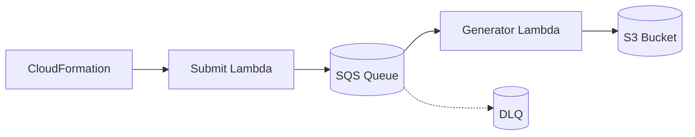

<h1 align="center">VM Data Wheel</h1>

<p align="center">
  <b>Scalable data generation for video reasoning models using AWS Lambda.</b>
</p>

<p align="center">
  <a href="https://github.com/vm-dataset">
    
  </a>
  
  
  
</p>

<p align="center">
  <a href="#one-click-deploy">Deploy</a> •
  <a href="#what-is-vm-data-wheel">About</a> •
  <a href="#quick-start">Quick Start</a> •
  <a href="#documentation">Docs</a>
</p>

---

<div align="center">

## One-Click Deploy

**Deploy to your AWS account in minutes — no local setup required.**

<a href="https://console.aws.amazon.com/cloudformation/home?#/stacks/new?stackName=vm-data-wheel&templateURL=https://raw.githubusercontent.com/Video-Reason/VMDataWheel/main/cloudformation/VmDatasetPipelineStack.template.json">
  
</a>

> **Stack name must be lowercase** (e.g., `vm-data-wheel`)

| S3 Bucket | SQS Queue | Lambda (3GB) | DLQ |
|:---------:|:---------:|:------------:|:---:|
| Output storage | Task queue | 50+ generators | Auto-retry |

</div>

<details>
<summary><b>After deployment — How to use</b></summary>

<br>

**Option 1: Invoke Submit Lambda (Recommended)**

Go to AWS Console → Lambda → `{stack-name}-submit-tasks` → Test with:

```json
{
  "generators": ["O-41_nonogram_data-generator", "O-42_object_permanence_data-generator"],
  "samples": 10000,
  "batch_size": 25
}
```

Or use AWS CLI:
```bash
aws lambda invoke \
  --function-name vm-data-wheel-submit-tasks \
  --payload '{"samples": 10000}' \
  response.json
```

**Option 2: Send SQS Messages Directly**

Go to AWS Console → SQS → `{stack-name}-queue` → Send message:

```json
{
  "type": "O-41_nonogram_data-generator",
  "start_index": 0,
  "num_samples": 25,
  "seed": 42,
  "output_format": "tar"
}
```

**Download results:**
```bash
aws s3 sync s3://{stack-name}-output-{account-id} ./results
```

</details>

---

## What is VM Data Wheel?

A serverless framework for generating synthetic video-reasoning samples at scale. Submit tasks to SQS, Lambda generates samples in parallel — 10K to millions with zero infrastructure.

Each sample includes:
```
{task_id}/
├── first_frame.png    # Initial state
├── final_frame.png    # Target state
├── prompt.txt         # Task description
└── ground_truth.mp4   # Solution video (optional)
```

**Why use this?**
- Serverless scale (10K to 1M+ samples)
- Deterministic with seed control
- 50+ generator types (physics, puzzles, spatial reasoning)
- Auto-retry with DLQ

---

## Quick Start

> For developers who want to modify the code or deploy with CDK.

```bash
# Clone and install
git clone https://github.com/Video-Reason/VMDataWheel
cd VMDataWheel
uv sync --extra dev --extra cdk

# Download generators
cd scripts && ./download_all_repos.sh && cd ..

# Local testing
uv run python scripts/test_server.py  # http://localhost:8000

# Deploy with CDK
export AWS_PROFILE=your-profile
uv run cdk bootstrap  # first time only
uv run cdk deploy
```

**Prerequisites:** Python 3.11+, [UV](https://github.com/astral-sh/uv), [AWS CLI](https://aws.amazon.com/cli/), Docker

---

## Example Generators

<details>
<summary><b>Puzzles & Logic</b></summary>

| Generator | Description |
|-----------|-------------|
| `O-41_nonogram` | Solve nonogram puzzles |
| `O-sudoku` | Complete Sudoku grids |
| `O-maze` | Find path through mazes |
| `O-logic_gates` | Evaluate logic circuits |

</details>

<details>
<summary><b>Physics & Motion</b></summary>

| Generator | Description |
|-----------|-------------|
| `G-object_trajectory` | Predict motion paths |
| `G-collision` | Simulate collisions |
| `G-gravity` | Objects falling |
| `G-bounce` | Ball bouncing |

</details>

<details>
<summary><b>Spatial & Visual</b></summary>

| Generator | Description |
|-----------|-------------|
| `O-42_object_permanence` | Track occluded objects |
| `O-43_object_subtraction` | Count remaining objects |
| `O-shape_transform` | Shape transformations |
| `O-color_mixing` | Color combinations |

</details>

---

## Architecture



| Type | Description | Memory | Examples |
|:----:|-------------|:------:|----------|
| **O-** | Static/Logic | Low | Puzzles, counting |
| **G-** | Dynamic/Physics | High | Animation, simulation |

---

## Documentation

| Resource | Description |
|----------|-------------|
| [CLAUDE.md](./CLAUDE.md) | Development guidelines |
| [scripts/SQS_README.md](./scripts/SQS_README.md) | SQS operations |

<details>
<summary><b>Task Message Format</b></summary>

```json
{
  "type": "O-41_nonogram_data-generator",
  "start_index": 0,
  "num_samples": 25,
  "seed": 42,
  "output_format": "tar"
}
```

| Field | Required | Default | Description |
|-------|:--------:|---------|-------------|
| `type` | ✓ | — | Generator name |
| `start_index` | | `0` | Starting sample ID |
| `num_samples` | ✓ | — | Samples per batch (≤100) |
| `seed` | | random | For reproducibility |
| `output_format` | | `files` | `files` or `tar` |

</details>

<details>
<summary><b>Lambda/SQS Settings</b></summary>

| Parameter | Value |
|-----------|-------|
| Lambda Memory | 3 GB |
| Lambda Timeout | 15 min |
| SQS Visibility Timeout | 16 min |
| Max Retries | 3 |

</details>

---

## Scripts Reference

| Script | Description |
|--------|-------------|
| `submit_tasks.py` | Submit tasks to SQS |
| `sqs_monitor.py` | Monitor queue status |
| `test_server.py` | Local test Web UI |
| `local_test.py` | CLI testing |

---

## Project Structure

```
VMDataWheel/
├── src/                 # Lambda source
├── cdk/                 # CDK infrastructure
├── cloudformation/      # One-click deploy template
├── scripts/             # CLI utilities
├── tests/               # Unit tests
├── generators/          # Generator repos (gitignored)
└── Dockerfile           # Lambda container
```

---

## Contributing

See [CLAUDE.md](./CLAUDE.md) for guidelines.

```bash
uv sync --extra dev --extra cdk
uv run pytest
uv run ruff check src/ scripts/
```

---

## License

Apache-2.0

---

<p align="center">
  <sub>Part of the <a href="https://github.com/vm-dataset">vm-dataset</a> project</sub>
</p>
